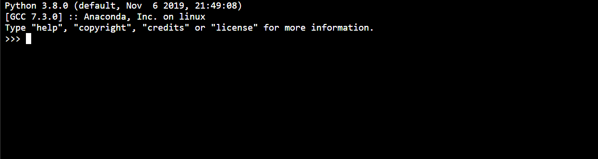

<!--
#  PyTorch Toolbox for Image Quality Assessment
 -->
#  用于图像质量评估的 PyTorch 工具箱

<!--
An IQA toolbox with pure python and pytorch. Please refer to [Awesome-Image-Quality-Assessment](https://github.com/chaofengc/Awesome-Image-Quality-Assessment) for a comprehensive survey of IQA methods and download links for IQA datasets.
 -->
一个纯 python 和 pytorch 的 IQA 工具箱。请参考 [Awesome-Image-Quality-Assessment](https://github.com/chaofengc/Awesome-Image-Quality-Assessment) 全面了解 IQA 方法和 IQA 数据集下载链接。

<a href="https://colab.research.google.com/drive/14J3KoyrjJ6R531DsdOy5Bza5xfeMODi6?usp=sharing"></a>
[](https://pypi.org/project/pyiqa/)

[](https://github.com/chaofengc/Awesome-Image-Quality-Assessment)
[](https://github.com/chaofengc/IQA-PyTorch/blob/main/README.md#bookmark_tabs-citation)


<!--

 -->


<!--
- [:open\_book: Introduction](#open_book-introduction)
- [:zap: Quick Start](#zap-quick-start)
  - [Dependencies and Installation](#dependencies-and-installation)
  - [Basic Usage](#basic-usage)
- [:1st\_place\_medal: Benchmark Performances and Model Zoo](#1st_place_medal-benchmark-performances-and-model-zoo)
  - [Results Calibration](#results-calibration)
  - [Performance Evaluation Protocol](#performance-evaluation-protocol)
  - [Benchmark Performance with Provided Script](#benchmark-performance-with-provided-script)
- [:hammer\_and\_wrench: Train](#hammer_and_wrench-train)
  - [Dataset Preparation](#dataset-preparation)
  - [Example Train Script](#example-trai-script)

## :open_book: Introduction
 -->
- [:open\_book: 简介](#open_book-introduction)
- [:zap: 快速启动](#zap-quick-start)
  - [依赖关系和安装](#dependency-and-installation)
  - [基本用法](#basic-usage)
- [:1st\_place\_medal：基准性能和 Model Zoo](#1st_place_medal-benchmark-performances-and-model-zoo)
  - [结果校准](#results-calibration)
  - [性能评估协议](#performance-evaluation-protocol)
  - [使用提供的脚本进行基准性能测试](#benchmark-performance-with-provided-script)
- [:hammer\_and\_wrench: 训练](#hammer_and_wrench-train)
  - [数据集准备](#dataset-preparation)
  - [训练脚本示例](#example-trai-script)
## :open_book: 简介

<!--
This is a image quality assessment toolbox with **pure python and pytorch**. We provide reimplementation of many mainstream full reference (FR) and no reference (NR) metrics (results are calibrated with official matlab scripts if exist). **With GPU acceleration, most of our implementations are much faster than Matlab.** Please refer to the following documents for details:
 -->
这是一个 **纯 python 和 pytorch** 的图像质量评估工具箱。我们提供了许多主流全参考 (FR) 和无参考 (NR) 指标的重新实现（结果使用官方 matlab 脚本（如果存在）进行校准）。**通过 GPU 加速，我们的大部分实现都比 Matlab 快很多。**具体请参考以下文档：

<div align="center">
<!--
📦 [Model Cards](docs/ModelCard.md)  |  🗃️ [Dataset Cards](docs/Dataset_Preparation.md)
 -->
📦 [模型卡](docs/ModelCard.md) | 🗃️ [数据集卡](docs/Dataset_Preparation.md)
</div>

---

<!--
### :triangular_flag_on_post: Updates/Changelog
- **Aug 15, 2023**. Add `st-lpips` and `laion_aes`. Refer to official repo at [ShiftTolerant-LPIPS](https://github.com/abhijay9/ShiftTolerant-LPIPS) and [improved-aesthetic-predictor](https://github.com/christophschuhmann/improved-aesthetic-predictor)
- **Aug 05, 2023**. Add our work `TOPIQ` with remarkable performance on almost all benchmarks via efficient Resnet50 backbone. Use it with `topiq_fr, topiq_nr, topiq_iaa` for Full-Reference, No-Reference and Aesthetic assessment respectively.
- **March 30, 2023**. Add [URanker](https://github.com/RQ-Wu/UnderwaterRanker) for IQA of under water images.
- **March 29, 2023**. :rotating_light: Hot fix of NRQM & PI.
- **March 25, 2023**. Add TreS, HyperIQA, CNNIQA, CLIPIQA.
- [**More**](docs/history_changelog.md)
 -->
### :triangle_flag_on_post: 更新/变更日志
- **2023 年 8 月 15 日**. 添加 `st-lpips` 和 `laion_aes`。请参阅 [ShiftTolerant-LPIPS](https://github.com/abhijay9/ShiftTolerant-LPIPS) 和 [improved-aesthetic-predictor](https://github.com/christophschuhmann/improved-aesthetic-predictor) 的官方存储库
- **2023 年 8 月 5 日**. 通过高效的 Resnet50 主干，添加我们的工作 `TOPIQ`，在几乎所有基准测试中都具有出色的性能。将其与 `topiq_fr, topiq_nr, topiq_iaa` 结合使用，分别进行完全参考、无参考和审美评估。
- **2023 年 3 月 30 日**. 添加 [URanker](https://github.com/RQ-Wu/UnderwaterRanker) 用于水下图像的 IQA。
- **2023 年 3 月 29 日**.  :rotating_light：NRQM 和 PI 的热修复/Hot fix。
- **2023 年 3 月 25 日**. 添加 TreS、HyperIQA、CNNIQA、CLPIQA。
- [**更多**](docs/history_changelog.md)

---

<!--
## :zap: Quick Start
 -->
## :zap：快速入门

### 依赖关系和安装
- Ubuntu >= 18.04
- Python >= 3.8
- PyTorch >= 1.12
- Torchvision >= 0.13
- CUDA >= 10.2 (if use GPU)
```
# Install with pip
pip install pyiqa

# Install latest github version
pip uninstall pyiqa # if have older version installed already
pip install git+https://github.com/chaofengc/IQA-PyTorch.git

# Install with git clone
git clone https://github.com/chaofengc/IQA-PyTorch.git
cd IQA-PyTorch
pip install -r requirements.txt
python setup.py develop
```

### 基本用法

```
import pyiqa
import torch

# list all available metrics
print(pyiqa.list_models())

device = torch.device("cuda") if torch.cuda.is_available() else torch.device("cpu")

# create metric with default setting
iqa_metric = pyiqa.create_metric('lpips', device=device)
# Note that gradient propagation is disabled by default. set as_loss=True to enable it as a loss function.
iqa_loss = pyiqa.create_metric('lpips', device=device, as_loss=True)

# create metric with custom setting
iqa_metric = pyiqa.create_metric('psnr', test_y_channel=True, color_space='ycbcr').to(device)

# check if lower better or higher better
print(iqa_metric.lower_better)

# example for iqa score inference
# Tensor inputs, img_tensor_x/y: (N, 3, H, W), RGB, 0 ~ 1
score_fr = iqa_metric(img_tensor_x, img_tensor_y)
score_nr = iqa_metric(img_tensor_x)

# img path as inputs.
score_fr = iqa_metric('./ResultsCalibra/dist_dir/I03.bmp', './ResultsCalibra/ref_dir/I03.bmp')

# For FID metric, use directory or precomputed statistics as inputs
# refer to clean-fid for more details: https://github.com/GaParmar/clean-fid
fid_metric = pyiqa.create_metric('fid')
score = fid_metric('./ResultsCalibra/dist_dir/', './ResultsCalibra/ref_dir')
score = fid_metric('./ResultsCalibra/dist_dir/', dataset_name="FFHQ", dataset_res=1024, dataset_split="trainval70k")
```

<!--
#### Example Test script
 -->
#### 测试脚本示例

带有输入目录/图像和参考目录/图像的示例测试脚本。
```
# example for FR metric with dirs
python inference_iqa.py -m LPIPS[or lpips] -i ./ResultsCalibra/dist_dir[dist_img] -r ./ResultsCalibra/ref_dir[ref_img]

# example for NR metric with single image
python inference_iqa.py -m brisque -i ./ResultsCalibra/dist_dir/I03.bmp
```

<!--
## :1st_place_medal: Benchmark Performances and Model Zoo
 -->

## :1st_place_medal：基准性能和 Model Zoo

<!--
### Results Calibration
 -->
### 结果校准

<!--
Please refer to the [results calibration](./ResultsCalibra/ResultsCalibra.md) to verify the correctness of the python implementations compared with official scripts in matlab or python.
 -->
请参考[结果校准](./ResultsCalibra/ResultsCalibra.md)，与官方的 matlab 或 python 脚本相比，验证 python 实现的正确性。

<!--
### Performance Evaluation Protocol
 -->
### 性能评估协议

<!--
**We use official models for evaluation if available.** Otherwise, we use the following settings to train and evaluate different models for simplicity and consistency:
 -->
**如果可用，我们使用官方模型进行评估。**否则，我们使用以下设置来训练和评估不同的模型，以实现简单性和一致性：

| Metric Type   | Train     | Test                                       | Results                                                  |
| ------------- | --------- | ------------------------------------------ | -------------------------------------------------------- |
| FR            | KADID-10k | CSIQ, LIVE, TID2008, TID2013               | [FR benchmark results](tests/FR_benchmark_results.csv)   |
| NR            | KonIQ-10k | LIVEC, KonIQ-10k (official split), TID2013, SPAQ | [NR benchmark results](tests/NR_benchmark_results.csv)   |
| Aesthetic IQA | AVA       | AVA (official split)                       | [IAA benchmark results](tests/IAA_benchmark_results.csv) |

<!--
Results are calculated with:
- **PLCC without any correction**. Although test time value correction is common in IQA papers, we want to use the original value in our benchmark.
- **Full image single input.** We use multi-patch testing only when it is necessary for the model to work.
 -->
结果计算如下：
- **PLCC 未经任何校正/PLCC without any correction**。尽管测试时间值校正在 IQA 论文中很常见，但我们希望在基准测试中使用原始值。
- **完整图像单输入/Full image single input。** 仅当模型需要时，我们才使用多补丁测试。

<!--
Basically, we use the largest existing datasets for training, and cross dataset evaluation performance for fair comparison. The following models do not provide official weights, and are retrained by our scripts:
 -->
基本上，我们使用最大的现有数据集进行训练，并使用跨数据集评估性能进行公平比较。以下模型不提供官方权重，并由我们的脚本重新训练：


| Metric Type   | Reproduced Models |
| ------------- | ----------------------------- |
| FR            |                               |
| NR            | `cnniqa`, `dbcnn`, `hyperiqa` |
| Aesthetic IQA | `nima`, `nima-vgg16-ava`      |

<!--
**Important Notes:**
- Due to optimized training process, performance of some retrained approaches may be different with original paper.
- Results of all **retrained models by ours** are normalized to [0, 1] and change to higher better for convenience.
- Results of KonIQ-10k, AVA are both tested with official split.
- NIMA is only applicable to AVA dataset now. We use `inception_resnet_v2` for default `nima`.
- MUSIQ is not included in the IAA benchmark because we do not have train/split information of the official model.
 -->
**重要提示：**
- 由于优化了训练过程，一些重新训练方法的性能可能与原始论文不同。
- 我们的所有**重新训练模型**的结果都标准化为 [0, 1]，方便起见，更改为更高更好。
- KonIQ-10k、AVA 的结果均经过官方拆分测试。
- NIMA 目前仅适用于 AVA 数据集。我们使用 `inception_resnet_v2` 作为默认的 `nima`。
- MUSIQ 未包含在 IAA 基准测试中，因为我们没有官方模型的训练/拆分信息。

<!--
### Benchmark Performance with Provided Script
 -->
### 使用提供的脚本进行基准性能测试

下面是一个示例脚本，用于获取不同数据集的性能基准：
```
# NOTE: this script will test ALL specified metrics on ALL specified datasets
# Test default metrics on default datasets
python benchmark_results.py -m psnr ssim -d csiq tid2013 tid2008

# Test with your own options
python benchmark_results.py -m psnr --data_opt options/example_benchmark_data_opts.yml

python benchmark_results.py --metric_opt options/example_benchmark_metric_opts.yml tid2013 tid2008

python benchmark_results.py --metric_opt options/example_benchmark_metric_opts.yml --data_opt options/example_benchmark_data_opts.yml
```

<!--
## :hammer_and_wrench: Train
 -->

## :hammer_and_wrench: 训练

<!--
### Dataset Preparation
 -->
### 数据集准备

<!--
- You only need to unzip downloaded datasets from official website without any extra operation. And then make soft links of these dataset folder under `datasets/` folder. Download links are provided in [Awesome-Image-Quality-Assessment](https://github.com/chaofengc/Awesome-Image-Quality-Assessment).
- We provide common interface to load these datasets with the prepared meta information files and train/val/test split files, which can be downloaded from [download_link](https://github.com/chaofengc/IQA-PyTorch/releases/download/v0.1-weights/meta_info.tgz) and extract them to `datasets/` folder.
 -->
- 您只需从官方网站解压下载的数据集，无需任何额外操作。然后在 `datasets/` 文件夹下创建这些数据集文件夹的软链接。[Awesome-Image-Quality-Assessment](https://github.com/chaofengc/Awesome-Image-Quality-Assessment) 中提供了下载链接。
- 我们提供通用接口来加载这些数据集以及准备好的元信息文件和 train/val/test 分割文件，这些文件可以从[download_link](https://github.com/chaofengc/IQA-PyTorch/releases/download/v0.1-weights/meta_info.tgz) 下载并将它们提取到 `datasets/` 文件夹。

<!--
You may also use the following commands:
 -->
您还可以使用以下命令：

```
mkdir datasets && cd datasets

# make soft links of your dataset
ln -sf your/dataset/path datasetname

# download meta info files and train split files
wget https://github.com/chaofengc/IQA-PyTorch/releases/download/v0.1-weights/meta_info.tgz
tar -xvf data_info_files.tgz
```

<!--
Examples to specific dataset options can be found in `./options/default_dataset_opt.yml`. Details of the dataloader inferface and meta information files can be found in [Dataset Preparation](docs/Dataset_Preparation.md)
 -->
特定数据集配置的示例可以在 `./options/default_dataset_opt.yml` 中找到。 dataloader 接口和元信息文件的详细信息可以在[数据集准备](docs/Dataset_Preparation.md)中找到。

<!--
### Example Train Script
 -->
### 训练脚本示例

在 LIVEChallenge 数据集上训练 DBCNN 的示例
```
# train for single experiment
python pyiqa/train.py -opt options/train/DBCNN/train_DBCNN.yml

# train N splits for small datasets
python pyiqa/train_nsplits.py -opt options/train/DBCNN/train_DBCNN.yml
```

<!--
## :beers: Contribution
 -->

## :beers: 贡献

<!--
Any contributions to this repository are greatly appreciated. Please follow the [contribution instructions](docs/Instruction.md) for contribution guidance.
 -->
非常感谢对此存储库的任何贡献。请按照[贡献说明](docs/Instruction.md) 获取贡献指导。

<!--
## :scroll: License
 -->
## :scroll: 许可证

<!--
This work is licensed under a [NTU S-Lab License](https://github.com/chaofengc/IQA-PyTorch/blob/main/LICENSE_NTU-S-Lab) and <a rel="license" href="http://creativecommons.org/licenses/by-nc-sa/4.0/">Creative Commons Attribution-NonCommercial-ShareAlike 4.0 International License</a>.
 -->
本作品已获得 [NTU S-Lab 许可证](https://github.com/chaofengc/IQA-PyTorch/blob/main/LICENSE_NTU-S-Lab) 和 <a rel="license" href="http ://creativecommons.org/licenses/by-nc-sa/4.0/">知识共享署名-非商业性-相同方式共享 4.0 国际许可</a>。

<!--
<a rel="license" href="http://creativecommons.org/licenses/by-nc-sa/4.0/"></a>
 -->
<a rel="license" href="http://creativecommons.org/licenses/by-nc-sa/4.0/"></a>

<!--
## :bookmark_tabs: Citation
 -->
## :bookmark_tabs: 引文

<!--
If you find our codes helpful to your research, please consider to use the following citation:
 -->
如果您发现我们的代码对您的研究有帮助，请考虑使用以下引用：

```
@misc{pyiqa,
  title={{IQA-PyTorch}: PyTorch Toolbox for Image Quality Assessment},
  author={Chaofeng Chen and Jiadi Mo},
  year={2022},
  howpublished = "[Online]. Available: \url{https://github.com/chaofengc/IQA-PyTorch}"
}
```

如果对您有用，还请考虑引用我们的新工作 `TOPIQ`：
```
@misc{chen2023topiq,
      title={TOPIQ: A Top-down Approach from Semantics to Distortions for Image Quality Assessment},
      author={Chaofeng Chen and Jiadi Mo and Jingwen Hou and Haoning Wu and Liang Liao and Wenxiu Sun and Qiong Yan and Weisi Lin},
      year={2023},
      eprint={2308.03060},
      archivePrefix={arXiv},
      primaryClass={cs.CV}
}
```

<!--
## :heart: Acknowledgement
 -->

## :heart: 致谢

<!--
The code architecture is borrowed from [BasicSR](https://github.com/xinntao/BasicSR). Several implementations are taken from: [IQA-optimization](https://github.com/dingkeyan93/IQA-optimization), [Image-Quality-Assessment-Toolbox](https://github.com/RyanXingQL/Image-Quality-Assessment-Toolbox), [piq](https://github.com/photosynthesis-team/piq), [piqa](https://github.com/francois-rozet/piqa), [clean-fid](https://github.com/GaParmar/clean-fid)
 -->
代码架构借鉴了 [BasicSR](https://github.com/xinntao/BasicSR)。几种实现取自：[IQA-optimization](https://github.com/dingkeyan93/IQA-optimization)、[Image-Quality-Assessment-Toolbox](https://github.com/RyanXingQL/Image-Quality-Assessment-Toolbox)，[piq](https://github.com/photosynthesis-team/piq), [piqa](https://github.com/francois-rozet/piqa), [clean-fid](https://github.com/GaParmar/clean-fid)

<!--
We also thanks the following public repositories: [MUSIQ](https://github.com/google-research/google-research/tree/master/musiq), [DBCNN](https://github.com/zwx8981/DBCNN-PyTorch), [NIMA](https://github.com/kentsyx/Neural-IMage-Assessment), [HyperIQA](https://github.com/SSL92/hyperIQA), [CNNIQA](https://github.com/lidq92/CNNIQA), [WaDIQaM](https://github.com/lidq92/WaDIQaM), [PieAPP](https://github.com/prashnani/PerceptualImageError), [paq2piq](https://github.com/baidut/paq2piq), [MANIQA](https://github.com/IIGROUP/MANIQA)
 -->
我们还感谢以下公共存储库：[MUSIQ](https://github.com/google-research/google-research/tree/master/musiq), [DBCNN](https://github.com/zwx8981/DBCNN-PyTorch), [NIMA](https://github.com/kentsyx/Neural-IMage-Assessment), [HyperIQA](https://github.com/SSL92/hyperIQA), [CNNIQA](https://github.com/lidq92/CNNIQA), [WaDIQaM](https://github.com/lidq92/WaDIQaM), [PieAPP](https://github.com/prashnani/PerceptualImageError), [paq2piq](https://github.com/baidut/paq2piq), [MANIQA](https://github.com/IIGROUP/MANIQA)

<!--
## :e-mail: Contact
 -->
## :e-mail: 联系方式

<!--
If you have any questions, please email `chaofenghust@gmail.com`
 -->
如果您有任何疑问，请发送电子邮件至 `chaofenghust@gmail.com`